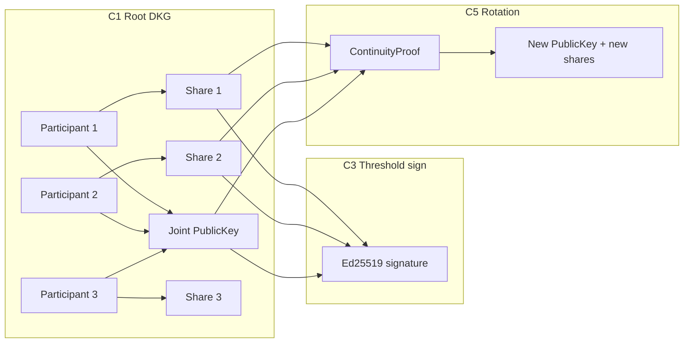

# GETTING_STARTED.md

**pqthreshold** — How to run, test, and understand the library

Status: operator guide (v1.0.0)  
Audience: developers evaluating or integrating the library  
Prerequisites: Dart SDK ^3.12, sibling [pqforge](https://pub.dev/packages/pqforge) ^0.4.4 for local dev (see §2)

Related: [TOOLING.md](TOOLING.md), [CEREMONIES.md](CEREMONIES.md), [API.md](API.md), [INTEGRATION.md](INTEGRATION.md)

---

## 1. What this library does

**pqthreshold** implements **threshold cryptography** in pure Dart: no single party ever holds the full private key after a proper ceremony.

You choose **t-of-n** (for example **2-of-3**):

- Any **t** honest participants can **threshold-sign**.
- **t − 1** shares are cryptographically useless for signing.
- The joint public key is a normal **32-byte Ed25519** key verifiable via **pqforge**.

| Ceremony | Name | What it achieves |
| -------- | ---- | ---------------- |
| **C1** | Root DKG | Create a threshold root with **no trusted dealer** |
| **C2** | Dealer VSS | Split an **existing** secret (Feldman VSS) |
| **C3** | Threshold signing | Produce a **64-byte Ed25519 signature** with FROST |
| **C5** | Rotation | New threshold key + **continuity proof** from the old quorum |

Runtime dependencies: **pqforge** (crypto) + **swissarmyknife** (state machines, validation). See [SCHEMES.md](SCHEMES.md) and [adr/002-runtime-dependencies.md](adr/002-runtime-dependencies.md).

---

## 2. Prerequisites

Clone or open the repository:

```bash
cd /path/to/pqthreshold
dart pub get
```

**pqforge 0.4.4+** is required (`PqBytes.sha512` for FROST profile hashes). For local development alongside the sibling repo:

```yaml
# pubspec.yaml (already present in this monorepo layout)
dependency_overrides:
  pqforge:
    path: ../pqforge
```

Before publishing or CI without a path override, **publish pqforge 0.4.4** to pub.dev and remove `dependency_overrides`.

---

## 3. How to run tests

### Full release gate (recommended)

```bash
dart run tool/verify.dart full
```

Runs: `pub get` → `dart analyze --fatal-infos` → all tests → required documentation manifest → phase test directories.

### Daily development

```bash
dart pub get
dart analyze
dart test
dart run tool/verify.dart quick   # same as CI
```

### Run tests by area

```bash
dart test test/sharing/          # Feldman VSS (Phase 2)
dart test test/dkg/              # DKG simulation (Phase 3)
dart test test/signing/          # FROST signing (Phase 4)
dart test test/ceremony/         # Rotation + continuity (Phase 5)
dart test test/serialization/    # PQTH round-trips (Phase 6)
dart test test/cli/              # CLI smoke tests
```

Acceptance vectors live under `test/vectors/`; see [TEST_VECTORS.md](TEST_VECTORS.md).

Regenerate vectors (deterministic test RNG):

```bash
dart run tool/generate_dkg_vectors.dart
dart run tool/generate_frost_vectors.dart
dart run tool/generate_rotation_vectors.dart
```

---

## 4. End-to-end example (C1 → C3 → C5)

The bundled example uses **Tier 2 simulators** (all parties in one process):

```bash
dart run example/pqthreshold_example.dart
```

On success you should see stepped output ending with `Example OK`:

```bash
dart run example/pqthreshold_example.dart
# or
dart run example/pqthreshold_example.dart && echo "Example OK"
```

**Do not** set `PqRandom.generator = PqBytes.randomBytes` — that aliases the generator to itself and causes a stack overflow. Use the default platform CSPRNG, or assign a real function (as tests do with a deterministic helper).

Automated check: `dart test test/example/pqthreshold_example_test.dart`

Source: `example/pqthreshold_example.dart` — DKG root → threshold-sign a credential → rotate with continuity proof → sign under the new key.

---

## 5. CLI — operator commands (v1.0.0)

The **`pqthreshold` executable** covers params, inspect, VSS, in-process DKG/signing, and ceremony workflows. **Multi-party dir-transport** (`dkg participant`) is deferred to v2 — use the library (`CeremonySession`) or `packages/crypto_shared` relay for production C1.

### 5.1 Commands you can run today

| Command | What it does |
| ------- | -------------- |
| `pqthreshold --help` | Grouped help (styled like pqforge) |
| `pqthreshold version` | Package version |
| `pqthreshold params validate --t 2 --n 3` | Check t/n limits ([PARAMS.md](PARAMS.md)) |
| `pqthreshold params export --t 2 --n 3 --out params.pqth` | Write 16-byte PQTH ThresholdParams file |
| `pqthreshold params validate --in params.pqth` | Validate an on-disk params file |
| `pqthreshold inspect --in <file>` | Describe PQTH objects, 16-byte ceremony.id, or wrapped-share JSON **without decrypting** |
| `pqthreshold vss split\|verify\|reconstruct` | C2 dealer ceremony ([CEREMONIES.md](CEREMONIES.md)) |
| `pqthreshold dkg simulate --t 2 --n 3 --out-dir ./dkg` | In-process C1 DKG + PQTH artifacts (CI/operator) |
| `pqthreshold sign run --share … --message … --out sig.bin` | Threshold-sign from ≥ t share files (primary C3 path) |
| `pqthreshold sign verify --public-key … --message … --signature …` | Ed25519 verify exit code |
| `pqthreshold ceremony run --flow c1\|c3\|c5\|full` | Orchestrated in-process ceremonies |

Examples:

```bash
dart run pqthreshold --help
dart run pqthreshold params validate --t 2 --n 3
dart run pqthreshold dkg simulate --t 2 --n 3 --out-dir ./dkg-out
dart run pqthreshold sign run \
  --share ./dkg-out/share-1.participant-1.pqth \
  --share ./dkg-out/share-2.participant-2.pqth \
  --message ./credential.bin --out ./credential.sig
dart run pqthreshold ceremony run --flow full
dart run pqthreshold inspect --in params.pqth
```

### 5.2 What the CLI does **not** do yet (use the library)

| Deferred (v2 or app layer) | Library / package today |
| -------------------------- | ----------------------- |
| `pqthreshold dkg participant …` (dir transport) | `CeremonySession` + `packages/crypto_shared` relay |
| `sign partial` → `sign combine` from disk (FROST round 2) | `sign run` (in-process) or `DistributedSigningCoordinator` |
| Wrapped share CLI (`*.share.wrapped.json`) | `packages/crypto_shared` `share_wrapping.dart` |

**Real-world ceremonies** require you to:

1. Move `DkgMessage` bytes between participants (files, Serverpod RPC, WebSocket, etc.).
2. Store each officer's `Share` in secure storage (not on a shared server).
3. Call `ThresholdSigner` from each signing device when a quorum is available.

Pair **pqforge** CLI for single-party device keys (`keygen`, `encrypt`, `sign`). See [TERMINAL.md](TERMINAL.md) §3 for the unified lifecycle vision.

---

## 6. Two API tiers

| Tier | Import | Use |
| ---- | ------ | --- |
| **Tier 1** | `package:pqthreshold/pqthreshold.dart` | Production: sessions, sign, verify, PQTH codecs |
| **Tier 2** | `package:pqthreshold/testing.dart` | Tests, examples, docs: in-process simulators |

**Tier 2 must not** be used as a production transport replacement. It runs every participant in one process for convenience.

Tier 2 exports:

- `DkgSimulator` — full C1 in one call
- `SigningSimulator` — full C3 in one call
- `RotationSimulator` — full C5 in one call

See [API.md](API.md) §2 for the formal split.

---

## 7. How it works — ceremony flows

### 7.1 Overview

```text
ThresholdParams (e.g. 2-of-3)
        │
        ▼
   C1 DKG ──► PublicKey (publish) + one Share per participant
        │
        ▼
   C3 Sign ──► any t shares + message ──► 64-byte Ed25519 signature
        │
        ▼
   C5 Rotate ──► new DKG + ContinuityProof (old quorum authorizes new key)
```



### 7.2 Step 1 — Create a threshold root (C1, DKG)

**Goal:** A joint public key and one private share per participant. The full secret never exists in one place.

**Production:** Each party runs `CeremonySession` (or `RootCeremony.startSession`) and exchanges wire messages over **your** authenticated transport. Messages: [PROTOCOL_MESSAGES.md](PROTOCOL_MESSAGES.md) §3.

**Testing / learning:**

```dart
import 'package:pqthreshold/testing.dart';

final params = ThresholdParams.tOfN(t: 2, n: 3);
final root = DkgSimulator.run(params: params);

// root.publicKey  — 32-byte Ed25519 joint key (publish to directory / chain)
// root.shares     — length n; each participant stores exactly ONE share
// root.transcripts — per-party audit logs (hash chain of public messages)
```

**Internal rounds:**

1. **Round 1** — Each participant generates a random polynomial and broadcasts Feldman commitments.
2. **Round 2** — Each sends private shares to every other participant; receivers verify against commitments.
3. **Finalize** — Each derives a final share; all parties compute the **same** joint public key.

Implementation: `lib/src/dkg/ceremony_session.dart`, `lib/src/scheme/dkg/`.

### 7.3 Step 2 — Threshold sign a message (C3, FROST)

**Goal:** A standard **64-byte Ed25519 signature** that verifies with pqforge (`PqClassical.provider.ed25519Verify`).

```dart
import 'dart:typed_data';

import 'package:pqthreshold/pqthreshold.dart';
import 'package:pqthreshold/testing.dart';

final message = Uint8List.fromList('membership-v1'.codeUnits);

// Simulator: first t shares sign in-process
final signature = await SigningSimulator.run(
  shares: root.shares,
  message: message,
);

final ok = await ThresholdSigner.verify(
  publicKey: root.publicKey,
  message: message,
  signature: signature,
);
```

**Production pattern** (coordinator optional):

1. Each of **t** signers: `ThresholdSigner.signPartial(share:, message:)`.
2. Coordinator (or last signer): `ThresholdSigner.combine(partials:, publicKey:, message:)`.
3. Verifiers: `ThresholdSigner.verify(...)`.

**Internal FROST rounds:**

1. **Round 1** — Nonce commitments (hiding + binding).
2. **Round 2** — Partial signature scalars; binding factors and group commitment.
3. **Combine** — Lagrange-weighted aggregation → Ed25519 `(R, s)`.

Profile: [FROST_PROFILE.md](FROST_PROFILE.md). Challenge hash (H2) uses RFC 8032 shape so pqforge Ed25519 verify succeeds.

**Security:** `signPartial` holds ephemeral nonces in memory until `combine`. Do **not** persist or transmit partials before combine in production; use wire rounds in [PROTOCOL_MESSAGES.md](PROTOCOL_MESSAGES.md) §5.

### 7.4 Step 3 — Rotate the root (C5)

**Goal:** A new threshold key plus evidence that the **old** quorum authorized the change.

```dart
final rotation = await RotationSimulator.run(
  oldShares: root.shares,
  oldPublicKey: root.publicKey,
);

await rotation.continuityProof.verify(oldPublicKey: root.publicKey);

rotation.newPublicKey;           // publish as successor root
rotation.newShares;              // distribute to participants
rotation.continuityProof.toBytes(); // store / publish PQTH kind 0x06
```

**Internal steps:**

1. Run a fresh DKG → new `PublicKey` + new `Share`s (new ceremony ID).
2. Build **continuity payload** ([PROTOCOL_MESSAGES.md](PROTOCOL_MESSAGES.md) §6): old/new public keys, ceremony IDs, timestamp.
3. Old quorum threshold-signs the payload.
4. Package as `ContinuityProof`; verifiers check signature under **old** public key.

### 7.5 Alternative — dealer-based sharing (C2)

When a trusted dealer already holds a secret (legacy import):

```dart
import 'package:pqthreshold/pqthreshold.dart';

final outcome = VerifiableSecretSharing.split(
  params: params,
  ceremonyId: ceremonyId,
  secret: existingSecret32Bytes,
);
// outcome.shares, outcome.publicKey, outcome.verificationData
```

The dealer knows the secret at split time. Prefer **C1 DKG** for new organizational roots ([CEREMONIES.md](CEREMONIES.md) §5).

---

## 8. Stored objects (PQTH wire format)

Durable objects use canonical **PQTH** bytes (`ver=0x01`, frozen at 1.0):

| Kind | Object | Typical use |
| ---- | ------ | ----------- |
| `0x01` | `ThresholdParams` | t, n, scheme |
| `0x02` | `Share` | Participant private share (+ verification blob) |
| `0x03` | `PublicKey` | Joint Ed25519 public key |
| `0x04` | `PartialSignature` | Archival public FROST round material |
| `0x05` | `Transcript` | Ceremony audit hash chain |
| `0x06` | `ContinuityProof` | Rotation authorization |

Serialize / deserialize:

```dart
final bytes = share.toBytes();
final restored = Share.fromBytes(bytes);
```

Full layout: [SERIALIZATION.md](SERIALIZATION.md).

---

## 9. What pqforge vs pqthreshold provide

| Concern | Package |
| ------- | ------- |
| Ed25519 verify, SHA-256/512, random bytes, classical crypto | **pqforge** |
| Feldman VSS, Gennaro DKG, FROST combine, ceremonies, PQTH | **pqthreshold** |
| State machines for DKG rounds | **swissarmyknife** (internal to pqthreshold) |

Typical application stack:

- **Daily crypto** (device keys, hybrid PQC envelopes) → pqforge / pqcrypto
- **Organizational root** (create, sign policy, rotate) → pqthreshold
- **Transport, auth, secure storage** → your application

See [INTEGRATION.md](INTEGRATION.md) §11 for a minimal integration sketch.

---

## 10. Quick sanity checklist

```bash
cd /path/to/pqthreshold
dart pub get
dart run example/pqthreshold_example.dart && echo "Example OK"
dart run tool/verify.dart full
```

Expected: **77 tests** pass in main package, **6** in `crypto_shared`, analyze clean, `verify: OK`.

Before high-assurance production deployment:

- Complete [REVIEW_CHECKLIST.md](REVIEW_CHECKLIST.md) (independent cryptographic review).
- Publish **pqforge 0.4.4+** and drop local `dependency_overrides` if used.
- Never store all shares on one server or one device.

---

## 12. Can this be used in the real world?

**Yes — as a library embedded in your app**, not as a turnkey terminal product yet.

| Ready today | You still build |
| ----------- | --------------- |
| DKG protocol (`CeremonySession`) | Authenticated transport between officers |
| FROST threshold sign / verify | Quorum coordination UI or service |
| PQTH serialize shares, keys, transcripts | Secure share storage per device |
| Continuity proofs for rotation | Policy / directory for published public keys |
| Tier 2 simulators for tests | Production wiring (never ship simulators to users) |

**Anti-patterns** (see [INTEGRATION.md](INTEGRATION.md) §12):

- Storing all shares on one Serverpod server → destroys threshold guarantee
- Making the server a share-holder for the org root → server compromise = root compromise
- Using `DkgSimulator` / `SigningSimulator` in production app code
- Threshold-signing every message → use pqforge for daily traffic; threshold only for high-value actions

---

## 13. Flutter app integration

Typical pattern: **each officer runs a Flutter app on their own device**; the app holds one share and talks to a **coordination service** that never sees share secrets.

```text
┌─────────────────┐     round messages      ┌──────────────────┐
│ Officer Flutter │ ◄──────────────────────►│ Coordinator      │
│ app             │   (DkgMessage bytes)    │ (Serverpod / API)│
│                 │                         │ stores public    │
│ flutter_secure_ │                         │ material only    │
│ storage: Share  │                         └──────────────────┘
└─────────────────┘
```

### 13.1 Dependencies

```yaml
# pubspec.yaml (Flutter officer app or shared package)
dependencies:
  pqthreshold: ^1.0.0
  pqforge: ^0.4.4          # verify, wrap shares (optional)
  flutter_secure_storage: ^9.0.0
```

### 13.2 Root DKG (C1) on device

```dart
import 'dart:typed_data';

import 'package:flutter_secure_storage/flutter_secure_storage.dart';
import 'package:pqthreshold/pqthreshold.dart';

Future<void> runDkgRound({
  required ThresholdParams params,
  required Uint8List ceremonyId,
  required String participantId,
  required int participantIndex,
  required List<DkgMessage> inbox,
}) async {
  final session = RootCeremony.startSession(
    params: params,
    ceremonyId: ceremonyId,
    participantId: participantId,
    participantIndex: participantIndex,
  );

  final outbox = session.processInbox(inbox);

  // Send each DkgMessage in outbox to coordinator → other participants
  // await api.postRoundMessages(outbox.map((m) => m.wireBytes).toList());

  if (session.isComplete) {
    final result = session.finalize();
    const storage = FlutterSecureStorage();
    await storage.write(
      key: 'threshold_share',
      value: String.fromCharCodes(result.share.toBytes()),
    );
    // Publish result.publicKey + result.transcript to directory (public bytes only)
  }
}
```

Your coordinator collects `DkgMessage.wireBytes` and routes them; it must **not** persist raw share scalars.

### 13.3 Threshold sign (C3) on device

```dart
import 'package:pqthreshold/pqthreshold.dart';

Future<PartialSignature> officerSignPartial({
  required Share share,
  required Uint8List message,
}) async {
  return ThresholdSigner.signPartial(share: share, message: message);
}

// Coordinator (or last signer) after collecting ≥ t partials:
Uint8List combineSignature({
  required List<PartialSignature> partials,
  required PublicKey publicKey,
  required Uint8List message,
}) {
  return ThresholdSigner.combine(
    partials: partials,
    publicKey: publicKey,
    message: message,
  );
}
```

Partials contain sensitive nonce material until combine — treat as ephemeral; see [API.md](API.md) §4.3.

### 13.4 Daily crypto on the same device

Member **device keys** (hybrid PQC seal/sign) stay on **pqforge** / **pqcrypto**. The threshold root only **attests** membership or signs policy — not every chat message.

---

## 14. Serverpod integration

**The Serverpod server should coordinate, not custody.**

| Server **may** store | Server **must not** store |
| -------------------- | ------------------------- |
| `PublicKey`, `Transcript`, `ContinuityProof` | `Share` secret scalars |
| DKG round message relay | All officers' shares in one DB row |
| Published joint public key | Wrapped share passphrases |

### 14.1 Serverpod endpoint sketch (copy-paste starting point)

A full example lives in [`example/serverpod_integration/`](../example/serverpod_integration/):

| File | Purpose |
| ---- | ------- |
| [`README.md`](../example/serverpod_integration/README.md) | Wiring steps |
| [`threshold_ceremony_endpoint.dart.example`](../example/serverpod_integration/threshold_ceremony_endpoint.dart.example) | Serverpod `Endpoint` delegating to [`ThresholdCeremonyService`](https://github.com/turkananation/pqthreshold/tree/main/packages/crypto_shared) |

The endpoint relays DKG wire bytes, stores public `PublicKey` / `Transcript`, and coordinates C3 partial collection — **never** share scalars.

Add **authentication** (officer identity) and **authorization** (participant list) on every RPC — pqthreshold does not provide this.

### 14.2 Shared Dart package (`packages/crypto_shared/`)

Monorepo helper package (sketch, `publish_to: none`):

```text
packages/crypto_shared/
  lib/crypto_shared.dart       # re-exports pqthreshold + pqforge
  lib/src/hex_codec.dart       # ceremony id / PQTH hex for JSON APIs
  lib/src/ceremony_relay.dart  # CeremonyMessageRelay + InMemoryCeremonyRelay
  lib/src/officer_dkg_client.dart
  lib/src/distributed_dkg.dart # DistributedDkgCoordinator
  lib/src/signing_job_coordinator.dart
  lib/src/threshold_ceremony_service.dart
```

Run tests:

```bash
cd packages/crypto_shared && dart pub get && dart test
```

Your app monorepo typically adds:

```text
officer_app/            # Flutter — holds Share, runs OfficerDkgClient
serverpod_server/       # ThresholdCeremonyEndpoint + DB relay
serverpod_client/       # generated + ceremony API wrappers
```

### 14.3 Verification on server or client

Combined signatures are **standard Ed25519**. Any tier can verify:

```dart
import 'package:pqthreshold/pqthreshold.dart';

final ok = await ThresholdSigner.verify(
  publicKey: orgRootPublicKey,
  message: credentialBytes,
  signature: combinedSig,
);
```

Same result as pqforge `PqClassical.provider.ed25519Verify` on the joint key bytes.

---

## 15. Minimal production checklist

- [ ] Officers on separate devices; share in `flutter_secure_storage` or HSM
- [ ] Coordinator/server relays **public** protocol messages only
- [ ] Joint `PublicKey` + `Transcript` published to directory after C1
- [ ] Threshold sign only credentials / policy / high-value actions (C3)
- [ ] Rotation publishes `ContinuityProof` (C5); verifiers check before trusting new key
- [ ] Complete [REVIEW_CHECKLIST.md](REVIEW_CHECKLIST.md) before high-assurance deployment

---

## 16. Where to read next

| Question | Document |
| -------- | -------- |
| Public Dart types | [API.md](API.md) |
| Multi-party operational flows | [CEREMONIES.md](CEREMONIES.md) |
| Byte-level wire messages | [PROTOCOL_MESSAGES.md](PROTOCOL_MESSAGES.md) |
| FROST ciphersuite details | [FROST_PROFILE.md](FROST_PROFILE.md) |
| Threat model | [SECURITY.md](SECURITY.md) |
| App integration patterns | [INTEGRATION.md](INTEGRATION.md) |
| Terminal vision (future CLI) | [TERMINAL.md](TERMINAL.md) |
| Full doc index | [INDEX.md](INDEX.md) |

---

## Document control

| Version | Change |
| ------- | ------ |
| 2026-08-13 | Initial getting started guide (run, test, ceremony flows) |
| 2026-08-13 | CLI reality table; Flutter/Serverpod integration; fix example PqRandom note |
| 2026-08-13 | v1.0.0 CLI table; 77+6 tests; operator commands documented |
